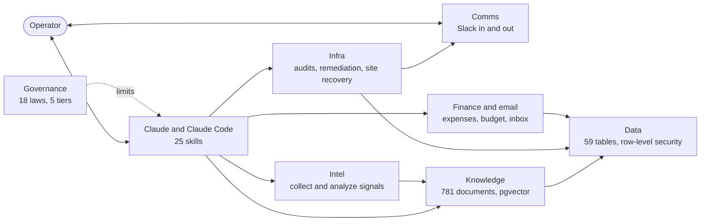

# Jordan Waxman

**AI Systems & Automation. I build governed AI agent systems and run them in production.**

I have 14 years of experience making large, complicated operations run reliably. Since August 2025 I have run my own business on an AI system I designed from scratch: agents that do real work, workflows that log what they did, and rules that stop the agents from doing what they shouldn't.

Models forget everything overnight. Outputs drift. A setup that worked last month breaks when the model updates. The repos below are what I built to deal with that, with the real skill files, workflows and SQL, and the mistakes that shaped each one.

Seattle, WA · [LinkedIn](https://linkedin.com/in/waxmanjordan) · [waxmanj@mac.com](mailto:waxmanj@mac.com)

      

---

## The system in one picture

36 workflows and 25 skills are published. 26 workflows are running today. The [hub repo](https://github.com/MrMinor-dev/ai-operating-system) explains how the systems connect and lists every piece.

## Where to look

| Repo | What it proves |
|---|---|
| [ai-operating-system](https://github.com/MrMinor-dev/ai-operating-system) | I can design a whole system and explain it: architecture, catalog, and 13 design write-ups. |
| [security-governance-framework](https://github.com/MrMinor-dev/security-governance-framework) | I can put hard limits on an AI agent: 18 laws, 5 authority tiers, and a design for catching myself approving without reading. |
| [database-security-framework](https://github.com/MrMinor-dev/database-security-framework) | I can give an agent database access without giving it the keys. An audit found 8 gaps in a system that looked secure. |
| [n8n-development-framework](https://github.com/MrMinor-dev/n8n-development-framework) | I build automation at volume and hold it to a standard: 24 real workflows and a 65-point audit before anything goes live. |
| [ai-skills-framework](https://github.com/MrMinor-dev/ai-skills-framework) | I write agent skills as versioned contracts. 25 real skill files you can read. |
| [rag-knowledge-base](https://github.com/MrMinor-dev/rag-knowledge-base) | I built retrieval over 781 business documents on Postgres and pgvector, and I know why chunks fail. |
| [human-ai-coordination-framework](https://github.com/MrMinor-dev/human-ai-coordination-framework) | I keep a human and an amnesic AI aligned across days: state documents, handoff contracts, async commands. |
| [back-office-automation](https://github.com/MrMinor-dev/back-office-automation) | I automate the back office with a hard line on money: 6 workflows, $0 of AI spending authority. |
| [mcp-server-installation-framework](https://github.com/MrMinor-dev/mcp-server-installation-framework) | I debug protocol failures from their symptoms and turn the fix into a repeatable install. |

## How I build

Every system here ran the same loop. Research the best practice. Design it. Build it. Run it in production. Watch it fail. Find the root cause. Fix it. Write the fix down as a rule. Bump the version. Start again.

`skill-creator-skill` is on version 3.8 because real use found a real problem at each earlier version. The workflow audit grew from 60 points to 65 the same way. The version number counts the failures I learned from.

## In production

- 26 active n8n workflows, each logging to a shared health table
- 59 Postgres tables with row-level security on every one
- 781 business documents indexed for semantic search
- Running since August 2025

---

[LinkedIn](https://linkedin.com/in/waxmanjordan) · [waxmanj@mac.com](mailto:waxmanj@mac.com)
